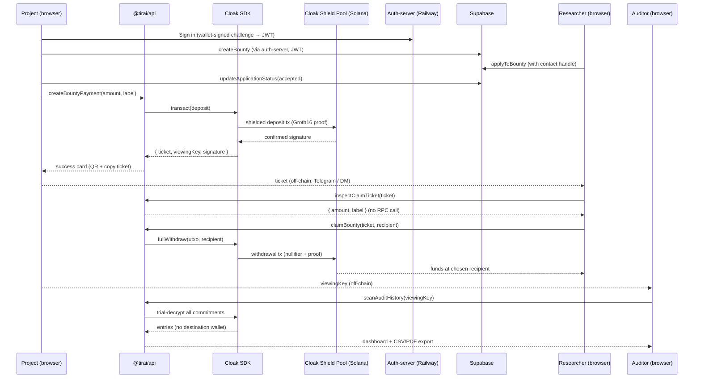

<p align="center">
  
</p>

<h1 align="center">Tirai</h1>

<p align="center">
  Privacy-first bounty payouts for Solana whitehats — one deposit, one withdrawal, no traceable link.
</p>

<p align="center">
  <a href="https://tirai-frontier.vercel.app">Live frontend</a>
  ·
  <a href="https://github.com/alventendrawan123/tirai">GitHub</a>
</p>

---

Tirai is a thin client over the **Cloak Shield Pool** on Solana. Project treasuries pay bug-bounty researchers privately: the deposit and the withdrawal happen on chain, but the link between them is severed by Groth16 proofs over a Poseidon Merkle tree. There is no Tirai program, no Tirai database, no Tirai server. The browser talks to Cloak; Cloak handles the cryptography.

> **One deposit. One withdrawal. No traceable link.**
>
> - **Project** signs a Cloak deposit and gets a one-time **claim ticket**, delivered off-chain to the researcher.
> - **Researcher** pastes the ticket, picks a wallet (existing or fresh), and withdraws via a ZK proof.
> - **Auditor** holds a viewing key, can list every payment the project ever made — but cannot see who received it.

---

## What Makes Tirai Special

### Who This Is For

Meet Bima. He runs a small Solana DeFi protocol with $4M TVL and a public bug-bounty program on Immunefi. Last month a whitehat reported a critical signature-malleability bug. The fix took six hours; the payout took six days.

The hold-up wasn't the money — Bima had USDC ready. The hold-up was *how to send it*. The researcher refused to share a personal wallet (KYC-linked to their Coinbase). Bima refused to send to a brand-new address with no history (treasury policy). Both of them spent the week negotiating a third-party intermediary, signing NDAs, and watching the bug sit unpatched in production.

Bima's problem isn't a missing wallet. It's that **paying a researcher publicly leaks who the researcher is.** Anyone watching the protocol's treasury wallet can see the destination, look it up on Solscan, cross-reference it with a CEX deposit, and dox the whitehat in five minutes. So researchers ask for fresh addresses; treasuries refuse fresh addresses; bounties stall.

There is no platform that lets a project pay a bounty in one click *and* lets the researcher receive it on a wallet that isn't linkable to anything they own.

---

### The Problem

Public bug-bounty payouts are a privacy disaster:

- **Treasury → researcher is a single edge on the graph.** Solscan shows `Wallet A sent N SOL to Wallet B`. If Wallet B has *any* prior history (a CEX deposit, an NFT mint, a friend.tech buy) it's trivially de-anonymized.
- **Researchers can't safely use fresh wallets.** Most projects' compliance policies forbid sending to addresses with no history. So whitehats reuse their main wallet — and get linked to the bug they reported, the protocol they reported it to, and the dollar amount they were paid.
- **Compliance still wants visibility.** A treasury that just stops disclosing payouts breaks audit trails. Accountants need a way to verify the project paid `$X` for bounty `Y` on date `Z`.
- **Existing privacy tooling doesn't fit.** General-purpose mixers are blanket-banned in most jurisdictions, and they don't give the project an auditable trail.

**How might we let a treasury pay a researcher privately, give the researcher full custody on a wallet that can't be linked back, and still let the project's auditor verify every payment after the fact?**

---

### The Solution

Tirai solves this with three primitives composed on top of the Cloak Shield Pool:

**1. Off-chain claim tickets** — When the project signs a Cloak deposit, the SDK returns a `ticket` (an opaque base58 blob containing the UTXO commitment + spending key). Tirai never persists this ticket; it surfaces it as a copy-paste blob and a QR code. The project delivers it out-of-band (Telegram, email, Signal). The researcher pastes it on `/claim` and the SDK trial-decrypts it to preview the amount before they ever sign.

**2. Fresh-wallet by default** — The claim flow offers two destination modes: *existing wallet* (the researcher's connected adapter) or *fresh wallet* (Tirai generates a brand-new keypair in the browser and forces the user through a non-dismissible save-key dialog). Fresh-wallet mode produces an address with zero on-chain history — the maximum-privacy default.

**3. Viewing-key-scoped audit** — When the project deposits, the SDK also returns a `viewingKey` (32 bytes). The project stores it locally and shares it with their auditor off-chain. On `/audit`, the auditor pastes the key and Tirai trial-decrypts every UTXO the key can see. The result: a full payment history with amount, date, label, and claim status — but **no destination wallet**. That field is intentionally absent from the SDK's audit output and from the Tirai UI.

Plus a thin **bounty board** (`/bounties`) backed by Supabase + a Railway auth-server, so projects can post bounties publicly, accept applications, and trigger the Cloak payout once a researcher is selected. The board is optional — `/pay`, `/claim`, and `/audit` all work standalone for off-board payments.

---

## How the Cloak SDK Is Used

The Cloak SDK is **the entire on-chain product**. Tirai owns the UX, the off-chain matching layer, and the privacy invariants we surface; Cloak owns the cryptography, the proof system, and the deployed program. Every wallet signature in Tirai is forwarded to a Cloak SDK call; every privacy guarantee is enforced inside the SDK or its program.

| SDK call | Where Tirai uses it | Why it matters |
|---|---|---|
| `transact` | `/pay` (project deposit) | Generates the Groth16 proof, builds the shielded deposit tx, returns the claim-ticket UTXO + viewing key. The on-chain side of "Project deposits to pool." |
| `inspectClaimTicket` | `/claim` (researcher preview) | Trial-decrypts a ticket without broadcasting anything. Lets the researcher see the amount + label before signing. |
| `fullWithdraw` | `/claim` (researcher claim) | Generates the withdrawal proof, consumes the nullifier, sends funds to the chosen recipient. The cryptographic break between deposit and withdrawal lives here. |
| `scanAuditHistory` | `/audit` (auditor scan) | Walks the program's history backwards, trial-decrypting every commitment with the viewing key. Never returns a destination wallet — the field doesn't exist in the output. |
| `exportAuditReport` | `/audit` (CSV/PDF export) | Formats `scanAuditHistory` output for compliance filing. |

The wrapper lives in [`@tirai/api`](backend/src/) and exposes only the four high-level operations above; the rest of the codebase never imports `@cloak.dev/sdk-*` directly. That boundary is intentional: the UI cannot accidentally surface a field the SDK doesn't expose, which means the auditor screen literally cannot leak the destination wallet — no amount of "just add the column" can introduce that bug.

### Why Cloak is central, not a swap-out

Tirai is built around the **viewing-key model that Cloak ships natively**. Generic mixers don't give you a per-deposit viewing key. Other Solana privacy tools either custody funds, require bridging, or don't expose an `inspect-without-claim` primitive. Replacing Cloak would mean redesigning every flow:

- The off-chain ticket → SDK preview → claim handshake collapses without `inspectClaimTicket`.
- The auditor flow collapses without scoped viewing keys.
- The fresh-wallet recipient pattern collapses without a withdrawal proof that can name an arbitrary destination.

Cloak is the substrate; Tirai is the UX. Pulling the substrate would leave nothing to wrap.

---

## Features

- **One-click bounty payout via Cloak Shield Pool** — Project signs once in Phantom; SDK builds the proof; deposit lands on the pool; ticket comes back instantly.
- **Off-chain claim ticket handoff** — Tirai never transmits the ticket. Copy-paste, QR code, or "ready-to-send Telegram message" templated to the researcher's contact handle.
- **Fresh-wallet recipient mode** — Generate a brand-new keypair in the browser; non-dismissible save-key dialog blocks claim until the user confirms they have stored it.
- **Existing-wallet mode** — Drop straight into Phantom / Solflare for researchers who don't need maximum unlinkability.
- **Viewing-key audit dashboard** — Paste a key, see every payment the project ever sent. Destination wallet column is structurally absent — not hidden by a flag, absent from the data type.
- **CSV + PDF export** — For accountants and compliance filing.
- **Public bounty board** *(optional layer)* — `/bounties` lists open bug bounties with reward, deadline, eligibility. Researchers apply with a contact handle (Telegram / Discord); owners accept one and pay through Cloak.
- **Wallet-only auth** — One-time EIP-191-style message signature; JWT valid for 1 hour. No email, no password, no KYC.
- **Strict monochrome design system** — Black, white, grayscale, light + dark mode toggle. No gradients, no animated brand colors.
- **End-to-end on Solana devnet** — Deployed live and demo-able today; mainnet is a one-line config change away.

---

## Tech Stack

| Layer | Technology |
|---|---|
| Frontend | Next.js 16 (Turbopack) · React 19 · TypeScript · Tailwind CSS v4 |
| State | React Query (server state) · Zustand-style providers (client state) · `next-themes` (light/dark) |
| Wallet | `@solana/wallet-adapter-react` (Phantom, Solflare, OKX, Brave) · `@solana/web3.js` |
| Privacy SDK | `@cloak.dev/sdk-devnet@^0.1.5` (devnet) — same surface as `@cloak.dev/sdk` (mainnet) |
| Proof system | Groth16 over BN254 · Poseidon Merkle tree (provided by Cloak) |
| Bounty board API | `@tirai/api` workspace package wrapping Cloak SDK + Supabase + auth-server |
| Bounty metadata | Supabase Postgres (RLS-protected, anon-key + JWT) |
| Auth-server | Hono on Railway (`/health`, `/auth/challenge`, `/auth/verify`, `/v1/bounties/*`, `/v1/applications/*`) |
| RPC | Helius devnet, fronted by `/api/rpc` allow-list proxy |
| All third-party origins | Hidden behind Next.js catch-all proxies (`/api/auth/*`, `/api/supabase/*`) — no upstream URL or anon key in the JS bundle |
| QR / clipboard | `qrcode` · native Clipboard API |
| Toasts | Sonner |
| Lint / format | Biome |

---

## Cloak SDK Integration

Every Cloak SDK call lives in the [`@tirai/api`](backend/src/) workspace package. The frontend's adapters are thin `safeAdapter()` wrappers that forward into these modules — there is no direct Cloak import inside `frontend/src/`.

| Component | File | Description |
|---|---|---|
| **Bounty payment** | [`backend/src/bounty/create-bounty-payment.ts`](backend/src/bounty/create-bounty-payment.ts) | Calls `transact()` to deposit into the Cloak pool. Returns `{ ticket, viewingKey, signature, feeLamports }`. |
| **Ticket inspect** | [`backend/src/claim/inspect-claim-ticket.ts`](backend/src/claim/inspect-claim-ticket.ts) | Decodes the off-chain ticket and returns `{ amountLamports, isClaimable, label, tokenMint }` without any RPC call. |
| **Claim** | [`backend/src/claim/claim-bounty.ts`](backend/src/claim/claim-bounty.ts) | Calls `fullWithdraw()` with the decoded UTXO + chosen recipient. Generates the withdrawal proof and submits the tx. |
| **Audit scan** | [`backend/src/audit/scan-audit-history.ts`](backend/src/audit/scan-audit-history.ts) | Iterates the Cloak program history, trial-decrypts with the viewing key, returns `{ entries[], summary }`. The `entries` shape has no destination wallet field. |
| **Audit export** | [`backend/src/audit/export-audit-report.ts`](backend/src/audit/export-audit-report.ts) | Renders the same scan output as a CSV or PDF using `pdf-lib`, browser-side. |
| **Frontend adapters** | [`frontend/src/features/{bounty,claim,audit}/adapters/`](frontend/src/features/) | `safeAdapter(() => sdkCall(...))` wrappers that map every Cloak error into Tirai's discriminated `AppError` union. |
| **React Query hooks** | [`frontend/src/features/{bounty,claim,audit}/hooks/`](frontend/src/features/) | `useBountyMutation`, `useClaimMutation`, `useScanAuditQuery`, etc. — what the pages actually consume. |

### Privacy invariants the wrapper enforces

- The auditor adapter never receives — and could not propagate — the recipient wallet. The Cloak SDK does not return it; the adapter type does not declare it; the UI does not render it. Three layers of "this column doesn't exist."
- The viewing key is held in `window.localStorage` under the depositor's pubkey, never sent to any backend. The auth-server, Supabase, and the proxy routes never see it.
- Claim tickets are surfaced once on the success card and then discarded from React state. Tirai does not write tickets to Supabase.

---

## Architecture

### System flow



### Layer boundaries

```
USER ROLES
├── Project    (treasury, payer)
├── Researcher (whitehat, claimant)
└── Auditor    (compliance reviewer)

FRONTEND · Next.js 16, runs entirely in the browser
└─ /bounties · /pay · /claim · /audit  (+ light/dark theme)

@tirai/api  workspace package
├─ bounty/   createBountyPayment()
├─ claim/    inspectClaimTicket(), claimBounty()
└─ audit/    scanAuditHistory(), exportAuditReport()

CLOAK SDK  external dependency
└─ transact, fullWithdraw, scanTx, complianceRpt, ...

CLOAK SHIELD POOL  already deployed on Solana — Tirai deploys nothing
├─ Devnet:  Zc1kHfp4rajSMeASFDwFFgkHRjv7dFQuLheJoQus27h
└─ Mainnet: zh1eLd6rSphLejbFfJEneUwzHRfMKxgzrgkfwA6qRkW

OFF-CHAIN INFRA  (bounty board only — payments work standalone)
├─ Auth-server on Railway     (wallet-signed JWT, 1h)
└─ Supabase Postgres + RLS    (bounty + application metadata)
```

---

## Setup

Tirai is a pnpm workspace. Two packages: `frontend` (Next.js app) and `backend` (the `@tirai/api` SDK wrapper — name is historical, it ships as a library, not a server).

### Prerequisites

- **Node** ≥ 20
- **pnpm** ≥ 9
- A **Solana wallet** with devnet SOL (Phantom or Solflare; airdrop at https://faucet.solana.com)
- Optional: a **Helius devnet RPC** key (the proxy works fine with public RPC, just slower)

### Frontend

```bash
git clone https://github.com/alventendrawan123/tirai.git
cd tirai

pnpm install

# Frontend env
cp frontend/.env.example frontend/.env.local
# Edit frontend/.env.local — required keys:
#
#   NEXT_PUBLIC_SOLANA_CLUSTER=devnet
#   NEXT_PUBLIC_RPC_PROXY_PATH=/api/rpc
#   NEXT_PUBLIC_DOMAIN=https://tirai-frontier.vercel.app
#
# Server-only (never reach the browser):
#   SOLANA_RPC_URL=https://devnet.helius-rpc.com/?api-key=...
#   SUPABASE_URL=https://<project>.supabase.co
#   SUPABASE_ANON_KEY=sb_publishable_...
#   AUTH_VERIFIER_URL=

pnpm --filter frontend dev
```

Open [http://localhost:3000](http://localhost:3000). All Supabase + auth-server traffic is proxied through `/api/supabase/*` and `/api/auth/*` — open DevTools Network tab to confirm no upstream URL leaks.

### Backend (`@tirai/api`)

The backend package is a TypeScript library, not a server. It builds to `dist/` and is consumed by the frontend via the workspace symlink.

```bash
pnpm --filter @tirai/api build
# Or, for live dev:
pnpm --filter @tirai/api dev
```

There is also a standalone auth-server in `backend/src/auth-server/` deployed to Railway at `https://tirai-production.up.railway.app`. It is the only piece of Tirai infrastructure that runs server-side.

### Tests

```bash
pnpm --filter frontend test          # vitest + jsdom
pnpm --filter frontend typecheck     # tsc --noEmit
pnpm --filter frontend lint          # biome
```

---

## How It Works

### Project flow (`/bounties` → `/pay`)

```
Sign in → Post bounty → Accept application → Pay (Cloak deposit) → Send ticket off-chain
```

1. Connect a wallet on `/bounties`, click *Sign in with wallet* (one EIP-191 signature, JWT valid 1 hour).
2. Click *New bounty*, fill title / description / reward / deadline. Optional eligibility note.
3. When researchers apply, accept one. UI auto-redirects to `/pay?bountyId=...` with the form pre-filled and locked.
4. Click *Pay bounty*. Cloak SDK generates the Groth16 deposit proof; Phantom signs it; the tx confirms on devnet.
5. Success card shows the ticket (QR + copy + "ready-to-send Telegram message" template). Send it to the researcher's contact handle.

### Researcher flow (`/claim`)

```
Receive ticket → Inspect (no tx) → Pick wallet mode → Claim (Cloak withdraw)
```

1. Open `/claim` and paste the ticket (or scan the QR).
2. *Inspect* trial-decrypts locally and shows the amount + label. No RPC call, no signature required.
3. Pick *Claim to my wallet* (existing connected wallet) or *Claim to a fresh wallet* (Tirai generates a keypair).
4. Click *Claim*. Cloak SDK builds the withdrawal proof; the tx confirms; funds land at the chosen recipient.
5. If fresh wallet was selected, a non-dismissible save-key dialog blocks until the user confirms they have stored the secret key.

> **🔒 What "private payout" actually means here**
>
> When the researcher claims, the funds settle through the Cloak Shield Pool — and **the deposit ↔ withdrawal pair is cryptographically hidden**:
>
> - **The project never sees the researcher's destination wallet.** They signed a deposit into the pool; the recipient is chosen by the researcher at claim time and is never reported back to the project (not in the SDK return, not in Supabase, not in the auditor view).
> - **The researcher's withdrawal does not reveal the project's wallet on-chain.** The withdrawal tx is just `Cloak Pool → recipient`. The Groth16 proof + Poseidon nullifier prove the claim is valid without naming which specific deposit it spends.
> - **A public observer (Solscan, indexers) sees two unrelated transactions** to/from the pool — no on-chain edge connecting Wallet A (project) to Wallet B (researcher).
> - **Choosing *fresh wallet* maximizes this** — Wallet B has zero prior history, so even off-chain de-anonymization (CEX cross-reference, NFT mint history) hits a dead end.
>
> Whatever the project and researcher know about each other off-chain (e.g. via `/bounties` metadata), the **on-chain payment edge does not exist**. That is the entire point of routing through Cloak.

### Auditor flow (`/audit`)

```
Receive viewing key → Scan history → Export
```

1. Project shares the viewing key off-chain (it appears once on the `/pay` success card).
2. Auditor pastes it on `/audit` and clicks *Scan*.
3. Cloak SDK iterates the program history backwards, trial-decrypting each commitment.
4. Dashboard renders amount, date, label, status. **Destination wallet is intentionally not present.**
5. Export to CSV or PDF for filing.

---

## Deployed program IDs and frontend links

| Asset | Value |
|---|---|
| Frontend (Vercel) | https://tirai-frontier.vercel.app |
| Auth-server (Railway) | https://tirai-production.up.railway.app |
| Cloak Shield Pool — **Devnet** | `Zc1kHfp4rajSMeASFDwFFgkHRjv7dFQuLheJoQus27h` |
| Cloak Shield Pool — **Mainnet** | `zh1eLd6rSphLejbFfJEneUwzHRfMKxgzrgkfwA6qRkW` |
| GitHub | https://github.com/alventendrawan123/tirai |

> Tirai itself does **not** deploy any Solana program. The Shield Pool is owned and deployed by the Cloak team — Tirai consumes their published program IDs via `@cloak.dev/sdk-devnet` (devnet) and `@cloak.dev/sdk` (mainnet).

---

## Privacy boundaries

Tirai enforces three guarantees, each at a different layer:

| # | Boundary | Where it's enforced |
|---|---|---|
| 1 | **Project ↔ Researcher (wallet link)** | Inside the Cloak Shield Pool. Deposit and withdrawal are unlinkable on chain by Groth16 + Poseidon Merkle tree. |
| 2 | **Researcher ↔ Public (KYC link)** | In the Tirai claim UI. Fresh-wallet mode generates a keypair with no on-chain history; save-key dialog is non-dismissible. |
| 3 | **Auditor ↔ Researcher (read-only scope)** | In the SDK + the wrapper type. The `scanAuditHistory` output has no destination wallet field; the wrapper preserves that absence. |

---

## Hackathon submission

| | |
|---|---|
| **Event** | Cloak Hackathon |
| **Track** | Frontier |
| **Live demo** | https://tirai-frontier.vercel.app |
| **Repo** | https://github.com/alventendrawan123/tirai |

---

## License

MIT

---

> *Pay privately. Receive privately. Audit precisely. Tirai.*
